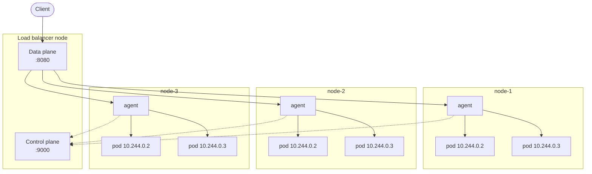

# orchard

> A toy Kubernetes: a hand-written L4 load balancer with its own control plane, node
> agents, and pods in their own network namespaces. All in Go, from scratch.

**Status:** work in progress. This is a learning project, not something to run anywhere
that matters.

---

## What this is

A miniature orchestrator, built by hand to understand how the real ones work. Nothing here
wraps an existing tool: the load balancer moves the bytes itself, the agent creates the
network namespaces itself, and the two talk over a protocol of their own.

There are two components, developed as if they were separate repositories, kept in one for
convenience:

- **`lb/`** — the load balancer. A data plane that forwards TCP connections, and a control
  plane that keeps track of which nodes exist and how they are doing.
- **`agent/`** — the node agent. Runs on every node, registers itself with the control
  plane, reports state, and creates and supervises pods locally.

Deliberately not implemented: services, cluster IPs, DNS, cross-node pod networking,
scheduling constraints, readiness/liveness/startup probes, declarative manifests. The
point is the data path and the control loop, not feature parity.

---

## Architecture



Solid lines carry traffic. Dashed lines carry state: registration, heartbeats, and the
node's own view of its health.

```
                         ┌──────────────────────────┐
        client ─────────▶│  :8080   data plane      │
                         │  :9000   control plane   │◀ ─ ─ ─ ─ ─ ─ ─ ─ ┐
                         └───────────┬──────────────┘                  ┆
                                     │                                 ┆
                 ┌───────────────────┼───────────────────┐             ┆
                 ▼                   ▼                   ▼             ┆
           ┌───────────┐       ┌───────────┐       ┌───────────┐       ┆
           │  node-1   │       │  node-2   │       │  node-3   │       ┆
           │  agent  ──┼───────┼── agent ──┼───────┼── agent ──┼─ ─ ─ ─┘
           │  ┌─────┐  │       │  ┌─────┐  │       │  ┌─────┐  │
           │  │ pod │  │       │  │ pod │  │       │  │ pod │  │
           │  ├─────┤  │       │  ├─────┤  │       │  ├─────┤  │
           │  │ pod │  │       │  │ pod │  │       │  │ pod │  │
           │  └─────┘  │       │  └─────┘  │       │  └─────┘  │
           └───────────┘       └───────────┘       └───────────┘
```

### Balancing happens twice

The load balancer picks a **node**. The agent on that node picks a **pod**. Two
independent decisions, each with its own affinity: once a connection is assigned, every
byte of it follows the same path until it closes.

This mirrors how a real cluster works — an external load balancer spreads traffic across
nodes, and kube-proxy spreads it across pods inside each one.

### Two listeners, never one

The data plane and the control plane listen on different ports, and the distinction is
absolute: anything arriving on `:8080` is a client, anything arriving on `:9000` is an
agent. The kernel demultiplexes by destination port for free, so the balancer never has to
inspect a payload to work out who is talking to it — which would break protocol-agnosticism
and deadlock against any protocol where the server speaks first.

### Pod addresses repeat across nodes

Every node hands out the same small range of pod IPs. They live inside per-node network
namespaces and never leave the node, so there is no conflict and no address coordination
to do. Kubernetes allocates a distinct range per node because it needs pod-to-pod traffic
across nodes; this project does not, and gets to skip the problem.

---

## Layout

```
orchard/
├── lb/       — load balancer: data plane, control plane, node registry
├── agent/    — node agent: registration, heartbeats, pod lifecycle, local forwarding
└── docs/     — notes and design write-ups
```

---

## Setting it up

Each piece runs on its own machine, all on the same LAN. A home router is enough.

### Requirements

- Go 1.25 or newer on every machine.
- Linux on every node that runs an agent. Pods live in network namespaces, which only
  exist on Linux, and the agent needs root (or `CAP_NET_ADMIN`) to create them.
- The load balancer itself runs on any OS.

### 1. Give the load balancer a fixed IP

Agents dial the control plane on `:9000` and clients dial the data plane on `:8080`, so the
load balancer's address must not change. The simplest way is a **DHCP reservation** on the
router:

1. Open the router's admin page (usually `http://192.168.1.1`) and go to the DHCP / LAN
   settings. Some routers call it "static IP" or "address reservation".
2. Find the load balancer machine in the list of connected devices and note its MAC address.
3. Add a reservation that ties that MAC to an IP, for example `192.168.1.50`.
4. Renew the lease on the machine so it picks up the address:
   - macOS: `sudo ipconfig set en0 DHCP`
   - Linux (NetworkManager): `nmcli connection down <name> && nmcli connection up <name>`
5. Check it: `ipconfig getifaddr en0` on macOS, `ip -4 addr` on Linux.

A reservation beats setting a static address on the machine itself: the router knows about
it and will never lend that IP to another device. If you set it by hand anyway, pick an
address outside the router's DHCP range.

> **Watch out for private MAC addresses.** macOS, iOS, Android and Windows can use a random
> Wi-Fi MAC per network, and some rotate it over time. If the MAC changes, the reservation
> stops matching and the machine gets a different IP. You can spot one because the second
> hex digit is `2`, `6`, `A` or `E` (e.g. `32:15:…`). On macOS: System Settings → Wi-Fi →
> Details on your network → Private Wi-Fi address → **Fixed** or **Off**. An Ethernet cable
> avoids the problem entirely.

Nodes don't need a reservation: they find the load balancer, not the other way round.

### 2. Bind to an address other machines can reach

The addresses the control plane and data plane listen on (in
[`lb/loadBalancer/lb.go`](lb/loadBalancer/lb.go)) must be reachable from the rest of the
LAN: either the reserved IP (`<LB_ADDRESS>:9000`) or all interfaces (`:9000`, `:8080`).
Never `localhost` or `127.0.0.1`, which only accept connections from the same machine.
Binding to all interfaces saves you from keeping the code and the router in sync.

### 3. Open the ports

Only the load balancer needs inbound ports, `8080/tcp` and `9000/tcp`.

- macOS: the first run asks whether to allow incoming connections — allow it. If you missed
  the prompt: System Settings → Network → Firewall → Options.
- Linux with ufw: `sudo ufw allow 8080/tcp && sudo ufw allow 9000/tcp`

### 4. Check it from another machine

Put the reserved IP in `.env.local` (git-ignored) and start the load balancer:

```sh
cp .env.example .env.local   # then set LB_ADDRESS
set -a; source .env.local; set +a
cd lb && go run ./cmd/lb
```

Then, from any other machine on the LAN:

```sh
nc -vz <LB_ADDRESS> 9000   # control plane
nc -vz <LB_ADDRESS> 8080   # data plane
```

Both should report the connection as succeeded. If they time out, go back to the firewall;
if they are refused, the process is not listening on that address.

---

## Why

Because reading about kube-proxy, veth pairs, conntrack and control loops is not the same
as having had to make them work. Everything here exists to be built by hand at least once.

## License

MIT